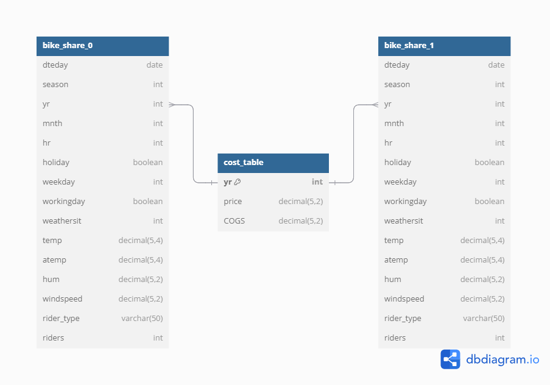
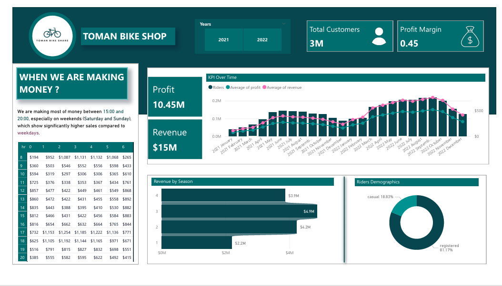

# End-to-End-Data-Analysis-Project-SQL-Power-BI

## 🌟 Overview
In this project,I embarked on an immersive, hands-on journey to transform raw Excel data into impactful, actionable insights by leveraging the powerful capabilities of PostgreSQL and Power BI. I built a robust PostgreSQL database, connected it to Power BI, and created a dynamic dashboard showcasing key performance metrics for Toman Bike (bike renting company).

## 🛠️ Project Workflow
- **Created a PostgreSQL Database:** I set up and structured a PostgreSQL database using data from Excel.
- **Developed SQL Queries:** I crafted and optimized SQL queries to extract and analyze data.
- **Connected to Power BI:** I linked my PostgreSQL database to Power BI for advanced visualizations.
- **Built a Dashboard:** I designed a dynamic Power BI dashboard with interactive features.
- **Answered Analysis Questions:** I provided insights and recommendations based on stakeholder queries.

## 📋 Project Requirements

### ✉️ Stakeholder Request
Here’s the challenge I received from our stakeholders:

**Dear Data Analyst,**

We need an engaging dashboard that includes:
- Hourly Revenue Analysis
- Profit and Revenue Trends
- Seasonal Revenue Insights
- Rider Demographics

The dashboard should reflect company’s colors and branding. Our main analysis question is: **"How can we adjust prices for next year?"**

## 🚀 Setup Instructions

### 🐘 Installed PostgreSQL
- **Downloaded:** I got PostgreSQL from the [official website](https://www.postgresql.org/download/).
- **Installed:** I followed the installation guide to set up PostgreSQL on my machine.

### 🗄️ Created a Database
- **Opened pgAdmin:** I connected to my PostgreSQL server.
- **Created a Database:** I created a new database named `BikeData`.
- **Imported Data:** I used pgAdmin and SQL commands to import data from Excel files into the `BikeData` database.



## 🔍 SQL Data Manipulation
I wrote SQL queries to:
- **Select Columns:** Choose the data I needed.
- **Join Tables:** Combine data for a comprehensive view.
- **Calculate Revenue and Profit:** Compute essential metrics for analysis.


### 📝 Example SQL Commands
```sql
-- Query to calculate revenue and profit by joining the combined bike share data with cost data
SELECT
    dteday, season, both_years.yr,
    hr, weekday, rider_type, riders,
    price, COGS,
    riders * price AS revenue,
    riders * price - COGS * riders AS profit
FROM both_years_join
LEFT JOIN cost_table ON cost_table.yr = both_years_join.yr;
```


## 📊 Power BI Dashboard Creation

### 🔗 Connected Power BI to PostgreSQL
- **Connected:** I used the PostgreSQL connector in Power BI to link to my `BikeData` database.
- **Loaded Data:** I imported the data needed for my visuals.


### 🎨 Designed the Dashboard


I designed visuals for:
- **Revenue Trends:** Line charts showing how revenue and profit evolved over time.
- **Seasonal Analysis:** Bar charts displaying revenue by season.
- **Rider Demographics:** donut charts illustrating rider profiles.


## 📈 Analysis and Recommendations
- **Impact Analysis:** I assessed how proposed price changes could affect performance.
- **Elasticity Calculation:** I determined price elasticity using historical data.
- **Price Recommendations:** I suggested a sensible price increase, typically 10-15%.


## 🤔 Challenges Faced:
**Data Quality Issues:**
Encountered missing and inconsistent data values during the import of Excel data into PostgreSQL, which could lead to inaccurate analysis.


## 🎉 Conclusion
This project provided me with a full-circle experience in data analysis, from creating a PostgreSQL database to crafting a Power BI dashboard packed with insights.


